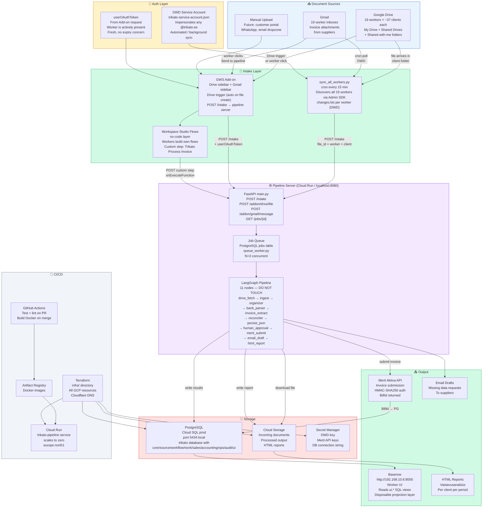
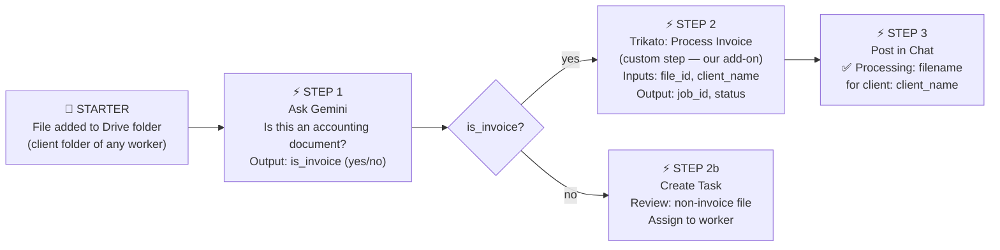
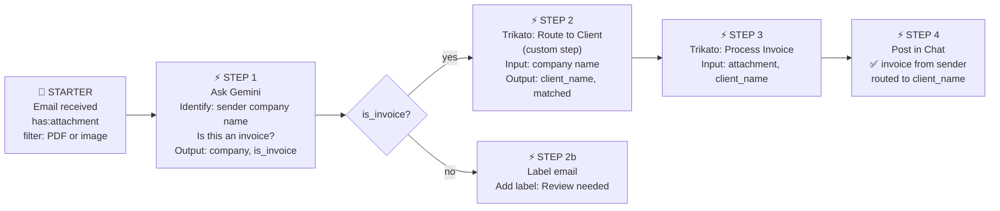
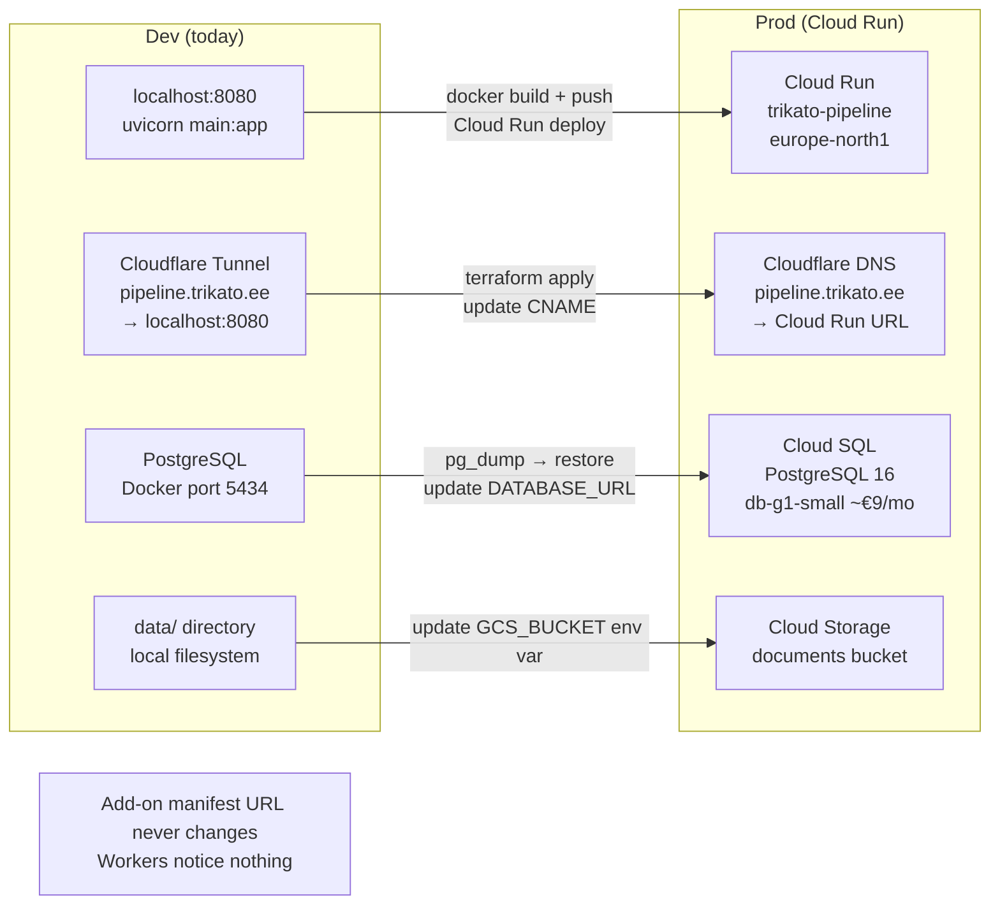

# Trikato OS — System Flowchart

## Current Implemented Foundation

As of 2026-03-24, the delivered base is:

- PostgreSQL-first foundation in
  `/home/martin/Trikato/User-tools/trikato-os/sql/schema.sql`
- Baserow-facing view layer in
  `/home/martin/Trikato/User-tools/trikato-os/sql/views.sql`
- main consolidated UI dataset: `ui.v_main_data_table`
- importer implementation in
  `/home/martin/Trikato/User-tools/accounting-pipeline/src/foundation_importer.py`
- full implementation log in
  `/home/martin/Trikato/User-tools/trikato-os/IMPLEMENTATION-LOG-2026-03-24.md`

## Full System (Mermaid)

---

## Workspace Studio Flow — Invoice Intake

---

## Workspace Studio Flow — Gmail Attachment Intake

---

## Dev → Prod Migration

